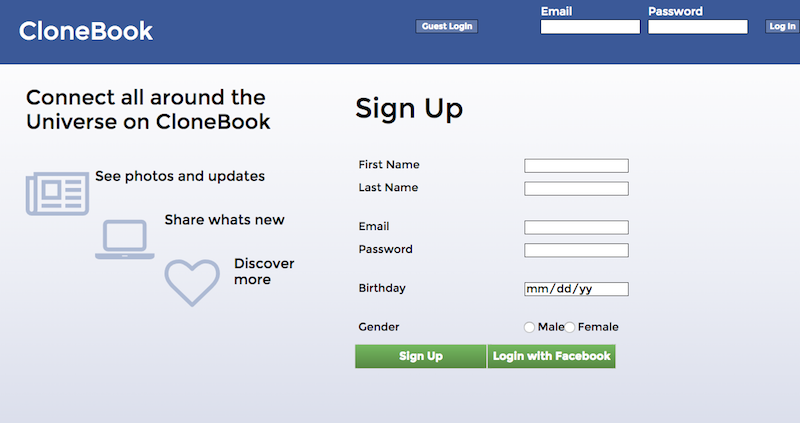

#Clonebook

[Link](http://clonebook.tech)

##Description
A social networking website for inspired by Facebook to connect to the Galaxies and Beyond!

##Features
Rails back end, React.js and Flux front end
Dynamic updating of posts, image uploads, and comments
Search across multiple attributes and through associations
Upload images through Paperclip and AWS S3
Search for users through PG_Search
Facebook login supported through OmniAuth

